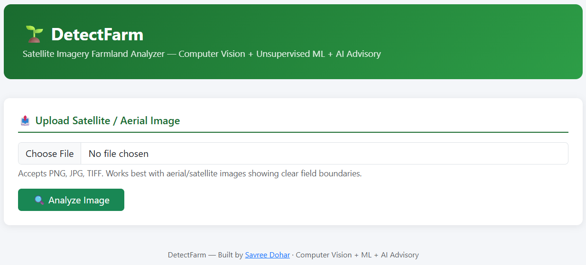
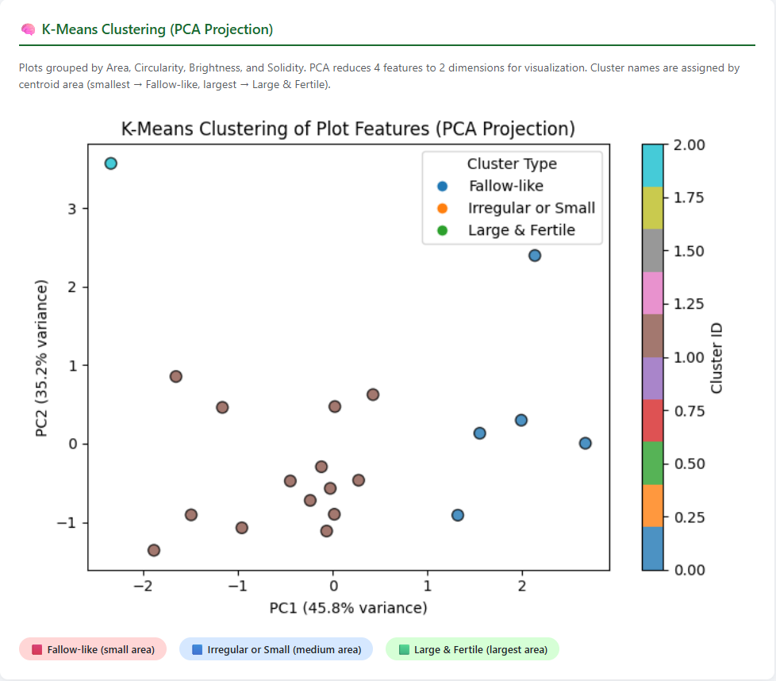
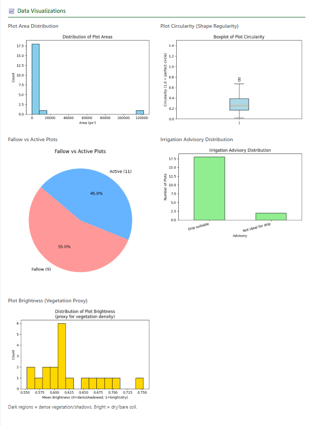

# 🌱 DetectFarm — Satellite Imagery Farmland Analyzer

> **Upload a satellite image. Get instant farmland intelligence.**  
> Computer Vision · Unsupervised ML · Real-time Analytics · Built at MANIT Bhopal

<div align="center">

[](https://sav06-detectfarm.hf.space)
[](https://github.com/Savree97/DetectFarm-Automated_Farmland_Analyzer)
[](https://python.org)
[](https://flask.palletsprojects.com)

</div>

---

## 🖼️ What It Looks Like

| 🏠 Upload Interface | 🧠 K-Means Clustering (PCA) |
|---|---|
|  |  |

| 📊 Data Visualizations |
|---|
|  |

> 👆 **Try it yourself** → [**sav06-detectfarm.hf.space**](https://sav06-detectfarm.hf.space)  
> Download [`example_input.png`](example_input.png) from this repo to test instantly.

---

## 🔍 What DetectFarm Does

Upload any satellite or aerial farmland image and DetectFarm automatically:

- 🗺️ **Detects & segments** individual field plots using OpenCV + scikit-image
- 📐 **Extracts 4 real geometric features** per plot — all computed from actual image pixels
- 🤖 **Clusters plots** into land-use categories using K-Means unsupervised learning
- 📈 **Generates 5 interactive visualizations** — area distribution, circularity, fallow pie, irrigation, brightness
- 📥 **Exports** a full Excel advisory report with per-plot recommendations

**Zero random values. Zero placeholders. Every feature is computed from the image.**

---

## ⚙️ Technical Pipeline

```
📸 Input Image (PNG / JPG / TIFF)
        │
        ▼
   Resize to 512×512  →  Grayscale  →  Gaussian Blur
        │
        ├──► Canny Edge Detection ──────────────────► Contour Overlay Image
        │
        └──► Otsu Thresholding (auto binary segmentation)
                  │
                  ▼
          Morphological Closing (fill boundary gaps)
                  │
                  ▼
         skimage.label() + regionprops(intensity_image=gray)
                  │
                  ▼
         ┌─────────────────────────────────────┐
         │     4 Real Computed Features         │
         │  • Area (px²)          region.area   │
         │  • Circularity         4π·A/P²        │
         │  • Mean Brightness     intensity_mean │
         │  • Solidity            A/convex_hull  │
         └─────────────────────────────────────┘
                  │
                  ▼
         StandardScaler → KMeans (k=3)
         Clusters named by centroid area:
         🔴 Fallow-like · 🔵 Irregular or Small · 🟢 Large & Fertile
                  │
                  ▼
         PCA → 2D cluster visualization
                  │
                  ▼
         Flask → Charts + Annotated Images + Excel Report
```

---

## 🧪 Feature Engineering

| Feature | How It's Computed | What It Means |
|---------|------------------|---------------|
| **Area (px²)** | `region.area` | Plot size — larger = more significant land |
| **Circularity** | `4π · area / perimeter²` | Shape regularity (1.0 = circle, <0.1 = very jagged) |
| **Mean Brightness** | `region.intensity_mean` | Vegetation proxy — dark = dense crop/shadow, bright = dry/bare soil |
| **Solidity** | `area / convex_hull_area` | Shape compactness — low = fragmented, hard to access mechanically |

---

## 🌾 Advisory Logic

| Feature | Threshold | Advisory Generated |
|---------|-----------|-------------------|
| Circularity | < 0.05 | ⚠️ Not ideal for drip irrigation |
| Mean Brightness | < 0.4 | ☁️ Lower solar potential |
| Solidity | < 0.7 | 🚜 Limited machinery access |
| Area | < 100 px² | 🌿 Fallow / composting candidate |

---

## 🛠️ Tech Stack

| Layer | Technology |
|-------|-----------|
| 🌐 Web Framework | Flask 3.0 |
| 🖼️ Image Processing | OpenCV, Pillow |
| 🔬 Feature Extraction | scikit-image (`regionprops`) |
| 🤖 ML Clustering | scikit-learn (KMeans, StandardScaler, PCA) |
| 📊 Data & Visualization | pandas, NumPy, Matplotlib |
| ☁️ Deployment | Hugging Face Spaces (Docker) |

---

## 🚀 Run Locally

```bash
# Clone the repo
git clone https://github.com/Savree97/DetectFarm-Automated_Farmland_Analyzer.git
cd DetectFarm-Automated_Farmland_Analyzer

# Install dependencies
pip install -r requirements.txt

# Run
python app.py
# Open http://localhost:5000
```

---

## 📌 Project Context

Built during a **Summer Research Internship** at  
**MANIT Bhopal — Centre of Excellence in Product Design and Smart Manufacturing** (June–July 2025)

**Research goal:** Automate farmland plot characterization from low-cost RGB satellite imagery without ground-truth labels, using unsupervised machine learning.

---

## 👤 Author

**Savree Dohar**  
B.Tech CSE · Thapar Institute of Engineering and Technology  

[](https://github.com/Savree97)
[](https://www.linkedin.com/in/savree-dohar-8a53002a2)
[](https://sav06-detectfarm.hf.space)

---

<div align="center">

Made with ❤️ for farmers, researchers, and the planet 🌍

</div>
